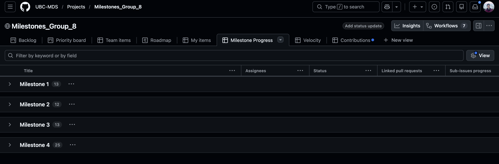
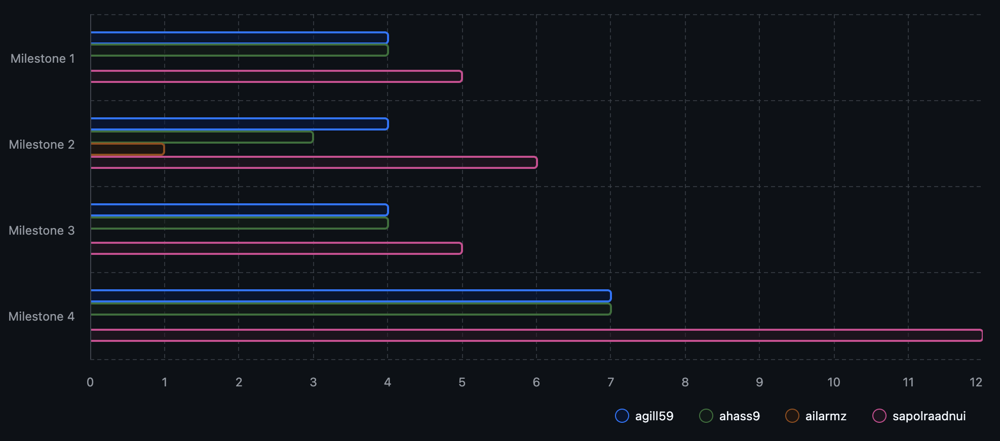
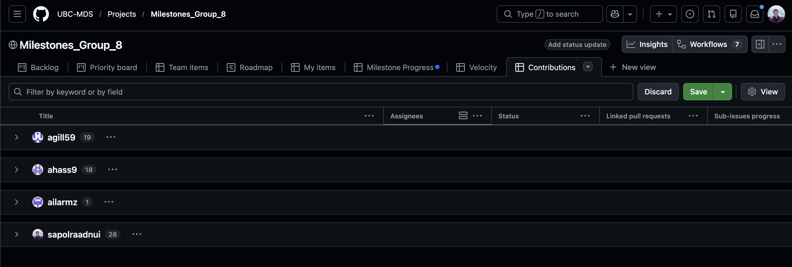

## Issue Assignment, Milestones, and Project Boards

Our team organized the project primarily using GitHub’s collaboration tools, which helped provide structure and transparency throughout the development process.

-   **Issues:** All major tasks such as feature development, documentation, testing, and infrastructure setup were tracked using GitHub issues. Each issue was assigned to specific team members and tagged with assignees and milestones, which helped clarify ownership and set clear expectations
-   **Project Board:** We used a GitHub Project Board with columns including *Backlog*, *Ready*, *In Progress*, *In Review*, and *Done*. This allowed us to easily visualize the current state of the project and track progress.
-   **Milestones:** Course deliverables were organized into milestone releases that aligned with each assignment checkpoint. This made it easier to prioritize tasks and monitor overall progress toward deadlines.

**Reflection:**\
Using GitHub issues and a shared project board helped reduce duplicated effort and improved coordination within the team. Clear issue assignments and milestone tagging ensured that work moved forward consistently and that responsibilities were well defined.

------------------------------------------------------------------------

## Analytical Project Board Views & Data-Driven Retrospective

Our retrospective was informed by GitHub Project views and issue analytics (where applicable).

### Velocity: How did our scope change over time?

Across milestones, we observed some changes in tasks. Earlier milestones (Milestones 1-3) included a larger number of exploratory and setup-related issues, while Milestone 4 focused more on refinement, documentation, and polishing.

------------------------------------------------------------------------

### Burn-up Chart: Were some milestones heavier than others?

The burn-up view suggests that **Milestone 4** involved the largest concentration of issues, largely since we incorporated all feedback from the previous milestones in Milestone 4 (e.g., function name change, refactoring, CI/CD setup, documentation updates, adding badges, etc.).

------------------------------------------------------------------------

### Team Contributions: Was the workload balanced?

The distribution of completed issues across team members was approximately balanced:

-   Paul Raadnui: 28 items
-   Amar Gill: 20 items
-   **Ashifa Hassam:** 17 items

**Reflection:**

Regular check-ins helped ensure workload remained equitable and that no single team member became a bottleneck.

------------------------------------------------------------------------

## Development Tools, Infrastructure, and Organizational Practices

-   **Version Control & Branching:** We used feature branches and pull requests to integrate changes into `main`. Also, we used a development branch (dev) for integrating features before merging to main. This ensures code quality and avoids running into merge conflicts.
-   **CI/CD:** GitHub Actions were used to automatically run tests and checks on pull requests and help with rendering website.
-   **Documentation:** Documentation was built using **Quarto** and **quartodoc**, enabling both narrative documentation and API references generated from source code.
-   **Code Reviews:** All PRs require at least one reviewer before merging.
-   **Communication:** The team primarily communicated through GitHub issues and pull requests as opposed to using other private channels such as Slack or email.

**Scaling Up Recommendations:**\
For a larger or longer-term project, we would consider:

-   More structured and standardized issue templates
-   Automated project board workflows and dependency tracking
-   Stricter branch protections and release tagging

------------------------------------------------------------------------

## DAKI Retrospective

**Drop:**

-   Last-minute pull request reviews close to deadlines

-   Creating issues without immediately assigning ownership/milestone

-   Last-minute cancelling meetings

**Add:**

-   Issue templates with acceptance criteria for feature and bug reports.

-   Regular project board/workload distribution checks

**Keep:**

-   Use of GitHub Project Boards and milestones to track progress.

-   Peer review before merging and CI checks on every PR.

-   Constant documentation updates

**Improve:**

-   Time estimation for documentation and review tasks (not only coding)

-   Earlier identification of task dependencies to reduce rework

------------------------------------------------------------------------

## Reflections

-   **Successes:** Using GitHub issues, project boards, and automated checks helped us stay organized and catch problems early. This made collaboration smoother and reduced friction when integrating everyone’s work.
-   **Improvements:** At the beginning, some tasks were not clearly scoped, which led to a bit of confusion. Over time, we realized the importance of writing clearer issue descriptions and defining acceptance criteria upfront.
-   **Teamwork:** Regular check-ins and shared responsibility across the team helped us stay aligned and support one another, leading to steady progress and a positive collaborative experience throughout the project.

------------------------------------------------------------------------

*Prepared by **Paul Raadnui, Amar Gill, and Ashifa Hassam**, 2025–26 DSCI-524 Group* 08
